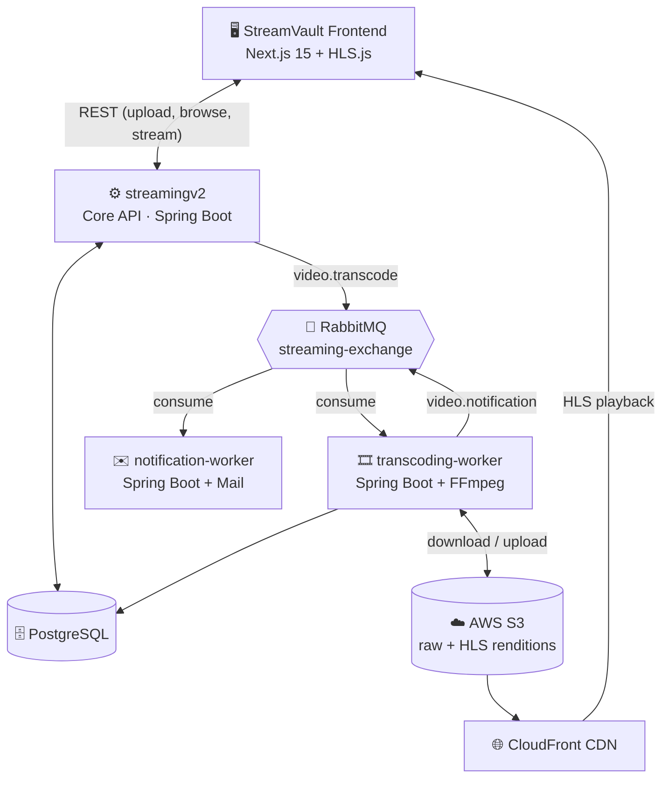

# 🎬 StreamVault — Distributed Video Streaming Platform

A YouTube/Netflix-style video platform built to explore **system design in practice**: event-driven microservices, async transcoding pipelines, adaptive bitrate streaming, and CDN-backed delivery — not just the theory.

Users upload a raw video → it's transcoded into multi-bitrate **HLS** in the background → they get an email when it's ready → they stream it through an adaptive player, served off **CloudFront**.

> This repo is a personal system-design build, not a course project. It intentionally uses the patterns a real VOD platform would: presigned uploads, a message broker decoupling services, and independently deployable workers.

---

## Architecture



### How a video moves through the system

1. **Upload request** — frontend calls `POST /api/upload/url`; `streamingv2` returns a **presigned S3 PUT URL** (no file ever touches the backend).
2. **Direct upload** — the browser uploads the raw file straight to S3, with progress tracked over XHR.
3. **Confirm** — frontend calls `POST /api/upload/complete`; `streamingv2` saves the video's metadata as `UPLOADED` and publishes a `video.transcode` message onto RabbitMQ.
4. **Transcode** — `transcoding-worker` consumes the job, downloads the source from S3, and shells out to **FFmpeg** to package it into three HLS renditions (1080p/5000k, 720p/2800k, 480p/1400k) with a master playlist.
5. **Publish renditions** — the HLS segments and playlists are uploaded back to S3; the video's status flips to `READY` and its `masterPlaylistKey` is stored.
6. **Notify** — the worker publishes `video.notification`; `notification-worker` consumes it and emails the uploader that their video is ready.
7. **Playback** — the frontend requests `GET /api/videos/{id}/stream`, gets back a CloudFront URL, and plays it adaptively with `hls.js`.

Every stage after the initial upload is **asynchronous and decoupled** — `streamingv2` never blocks on transcoding, and the two workers know nothing about each other except the exchange they share.

---

## Repository structure

| Path | What it is | Stack |
|---|---|---|
| [`streamingv2/`](./streamingv2) | Core API — upload orchestration, video metadata, presigned S3 URLs, publishes transcode jobs | Spring Boot 4, PostgreSQL, RabbitMQ, AWS SDK v2 |
| [`transcoding-worker/`](./transcoding-worker) | Consumes transcode jobs, runs FFmpeg to produce multi-bitrate HLS, uploads renditions to S3 | Spring Boot 4, FFmpeg, RabbitMQ, AWS SDK v2 |
| [`notification-worker/`](./notification-worker) | Consumes "video processed" events and emails the uploader | Spring Boot 4, Spring Mail, RabbitMQ |
| [`streamvault/`](./streamvault) | Primary web frontend — upload, browse by email, watch via HLS player | Next.js 15, TypeScript, Tailwind, shadcn/ui |
| [`frontend/`](./frontend) | Earlier iteration of the same frontend (v0-generated), kept for reference | Next.js, TypeScript |
| [`video-streaming-system/`](./video-streaming-system) | The original plain-Java prototype (in-memory video catalog) that preceded the microservices rewrite | Core Java |

> **Note:** `streamvault/` is the actively maintained frontend. `frontend/` was an earlier export of the same UI and is being phased out.

---

## Tech stack

**Backend** — Java 17 · Spring Boot 4 (Web, Data JPA, AMQP, Security, Mail) · PostgreSQL · Lombok

**Messaging** — RabbitMQ, one topic exchange (`streaming-exchange`) fanning out to `transcoding-queue` and `notification-queue` via routing keys `video.transcode` / `video.notification`

**Media processing** — FFmpeg, invoked per-job to produce 3 adaptive-bitrate HLS renditions from a single source

**Storage & delivery** — AWS S3 (raw uploads + transcoded HLS output), CloudFront (CDN in front of S3 for playback), presigned URLs for direct browser→S3 uploads (AWS SDK for Java v2)

**Frontend** — Next.js 15 (App Router, server + client components), TypeScript, Tailwind CSS, shadcn/ui, Axios, HLS.js

---

## API reference (`streamingv2`, default `:8080`)

| Method | Endpoint | Description |
|---|---|---|
| `POST` | `/api/upload/url` | Generate a presigned S3 upload URL for a new video |
| `POST` | `/api/upload/complete` | Confirm the upload, persist metadata, enqueue transcoding |
| `GET` | `/api/videos` | List all videos |
| `GET` | `/api/videos/{id}` | Get a single video by id |
| `GET` | `/api/videos/email/{email}` | List videos uploaded by a given email |
| `DELETE` | `/api/videos/{id}` | Delete a video |
| `GET` | `/api/videos/{id}/stream` | Get the CloudFront HLS URL (only once status is `READY`) |

---

## Getting started

### Prerequisites

- Java 17+ (Maven wrapper is included, no local Maven needed)
- Node.js 18+
- PostgreSQL
- RabbitMQ
- **FFmpeg** on the `PATH` — required by `transcoding-worker`, which shells out to it directly
- An AWS S3 bucket + CloudFront distribution in front of it
- SMTP credentials (e.g. a Gmail app password) for `notification-worker`

### 1. Infra

```bash
docker run -d --name pg -e POSTGRES_PASSWORD=postgres -p 5432:5432 postgres:16
docker run -d --name rabbitmq -p 5672:5672 -p 15672:15672 rabbitmq:3-management
```

### 2. Configure each service

None of the services ship a committed `application.properties` / `.env` (they're gitignored) — create one per service before running. `streamingv2` and `transcoding-worker` also read `.env` via `spring-dotenv`.

<details>
<summary><code>streamingv2</code></summary>

```properties
spring.datasource.url=jdbc:postgresql://localhost:5432/postgres
spring.datasource.username=postgres
spring.datasource.password=postgres

spring.rabbitmq.host=localhost
spring.rabbitmq.port=5672

aws.bucket-name=your-bucket
aws.region=ap-south-1
aws.access-key=...
aws.secret-key=...
cloudfront.domain=https://your-distribution.cloudfront.net
```
</details>

<details>
<summary><code>transcoding-worker</code></summary>

```properties
spring.datasource.url=jdbc:postgresql://localhost:5432/postgres
spring.datasource.username=postgres
spring.datasource.password=postgres

spring.rabbitmq.host=localhost
spring.rabbitmq.port=5672

aws.bucket-name=your-bucket
aws.region=ap-south-1
aws.access-key=...
aws.secret-key=...

worker.download-dir=worker-storage/downloads
worker.transcoded-dir=worker-storage/transcoded
```
</details>

<details>
<summary><code>notification-worker</code></summary>

```properties
spring.rabbitmq.host=localhost
spring.rabbitmq.port=5672

spring.mail.host=smtp.gmail.com
spring.mail.port=587
spring.mail.username=you@gmail.com
spring.mail.password=your-app-password
```
</details>

### 3. Run the services

```bash
# Core API — :8080
cd streamingv2 && ./mvnw spring-boot:run

# Transcoding worker
cd transcoding-worker && ./mvnw spring-boot:run

# Notification worker
cd notification-worker && ./mvnw spring-boot:run

# Frontend — :3000
cd streamvault && npm install && npm run dev
```

Set `NEXT_PUBLIC_API_BASE_URL=http://localhost:8080` in `streamvault/.env.local` so the frontend can reach the API.

---

## Status & roadmap

Working end-to-end: presigned uploads, async multi-bitrate transcoding, event-driven email notifications, adaptive HLS playback.

Known gaps, left as deliberate next steps:

- **Auth** — Spring Security is wired in, but the filter chain currently `permitAll()`s every request; JWT-based auth is the natural next layer.
- **Testing** — each service has a scaffolded `contextLoads()` test; unit/integration coverage for the service and worker layers is still to be written.
- **Resilience** — no dead-letter queue or retry policy yet on the transcoding/notification queues; a failed FFmpeg job currently just marks the video `FAILED`.
- **Thumbnails & pagination** — video listing has no thumbnails or pagination yet.

---

## Author

Built by **Akshat**, B.Tech CSE @ NIT Hamirpur — as a hands-on system design project exploring microservices, async processing, and streaming infrastructure.
